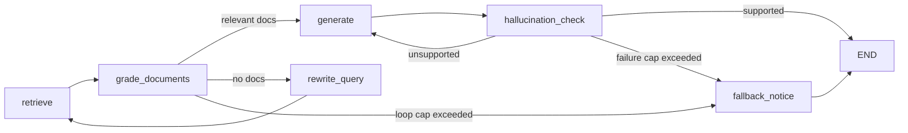

# Agentic RAG Knowledge System

A production-oriented, fully modular Agentic RAG stack built with LangChain, LangGraph, Chroma, RAGAS, and Streamlit. The repository is designed around a persistent local knowledge base, a self-correcting retrieval/generation graph, and a UI that exposes the full execution trace to the user.

## Repository Layout

```text
.
├── data/                      # Local storage for source PDF documents
├── chroma_db/                 # Persistent local vector store directory
├── src/
│   ├── __init__.py
│   ├── config.py              # Global configuration, paths, and hyperparameter tokens
│   ├── ingestion/
│   │   ├── __init__.py
│   │   └── chunk_and_embed.py # PDF processing pipeline and vector ingestion
│   ├── agent/
│   │   ├── __init__.py
│   │   ├── state.py           # Typed GraphState definition using langgraph
│   │   ├── nodes.py           # Core logic for routing, grading, rewriting, and generation
│   │   └── graph.py           # LangGraph workflow compilation and execution entry
│   └── eval/
│       ├── __init__.py
│       └── ragas_bench.py     # Quantitative RAGAS evaluation harness script
├── app.py                     # Streamlit frontend user interface layout
├── requirements.txt           # Explicit version-locked library dependencies
└── README.md                  # Comprehensive technical documentation
```

## Highlights

- Persistent Chroma vector storage with local HuggingFace embeddings.
- Typed state machine built with LangGraph for retrieval, grading, rewriting, generation, and grounding checks.
- A strict execution trace exposed in the Streamlit UI through `steps_taken` and `search_loop_count`.
- RAGAS evaluation harness that converts real execution traces into benchmarking samples.
- Defensive fallback behavior for missing PDFs, corrupted PDFs, empty retrieval results, and model/runtime failures.

## Setup

1. Create and activate a Python environment.
2. Install dependencies:

```bash
pip install -r requirements.txt
```

3. Configure environment variables as needed:

```bash
OPENAI_API_KEY=your_key_here
```

If you do not want to use OpenAI, run a local Ollama server and keep the default model settings in `src/config.py`.

## Ingestion

Place PDF files in `data/` and run:

```bash
python -m src.ingestion.chunk_and_embed
```

This will:
- discover PDFs recursively under `data/`
- split them with `RecursiveCharacterTextSplitter`
- embed them with `sentence-transformers/all-MiniLM-L6-v2`
- persist the resulting chunks into `chroma_db/`

## Agent Runtime

The agent workflow is compiled in `src/agent/graph.py` and uses these stages:



## Streamlit UI

Run the dashboard with:

```bash
streamlit run app.py
```

The sidebar supports PDF uploads and immediate re-indexing. The main chat area shows the answer and an expandable execution trace that lists every hop the agent took.

## Evaluation

Run the RAGAS benchmark with:

```bash
python -m src.eval.ragas_bench
```

The script builds a static five-question dataset, runs the compiled LangGraph agent for each query, converts the traces into a RAGAS evaluation dataset, and saves the outputs to a timestamped folder under `evaluation_logs/`.

## Configuration

Key settings live in `src/config.py` and are exposed via `BaseSettings`.

- `chunk_size`: default `500`
- `chunk_overlap`: default `50`
- `collection_name`: persistent Chroma collection name
- `search_loop_limit`: hard rewrite cap to prevent infinite correction loops
- `embedding_model_name`: `sentence-transformers/all-MiniLM-L6-v2`

## Operational Notes

- If no PDFs are present, ingestion completes gracefully and reports that nothing was indexed.
- If the active chat model is unavailable, the agent falls back to deterministic extractive behavior so the UI remains usable.
- The execution trace is intentionally retained in `steps_taken` so operators can inspect routing decisions without reading logs.

## Developer

- Run smoke tests: `python -m scripts.run_smoke_tests` or `scripts\\run_smoke_tests.py` from the repo root inside the venv.
- Cross-machine validation helper: `scripts\\cross_validate_windows.ps1` (PowerShell).
 
